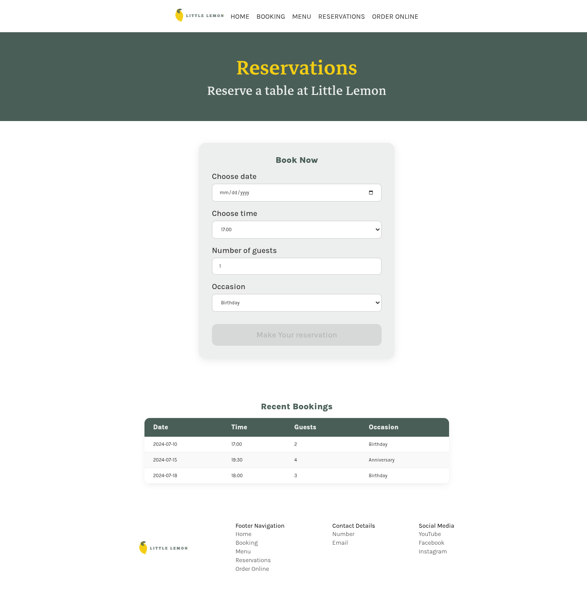
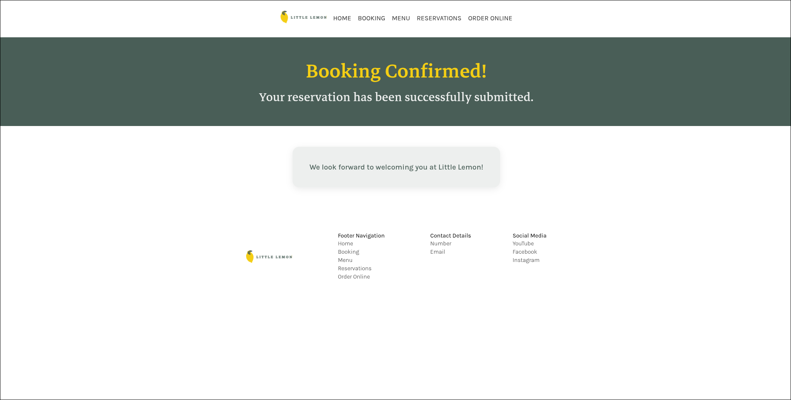
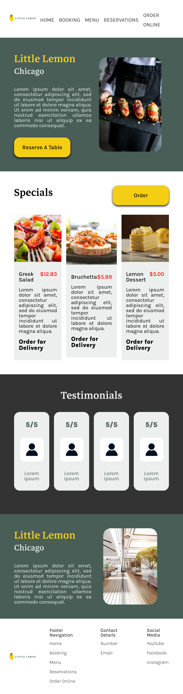

  

# Little Lemon Restaurant Web Application

The capstone project for the **[Meta Front-End Developer Professional Certificate](https://www.coursera.org/professional-certificates/meta-front-end-developer)** on Coursera. This web application provides a responsive, accessible, and interactive online table reservation system for Little Lemon, a Mediterranean restaurant based in Chicago.

---

## Preview

### Homepage

### Reservations Page

### Booking Confirmed

### Mobile Responsive Viewport

  

---

## Tech Stack

- **Frontend**: React 19, React Router DOM 7
- **Build Tool**: Vite 8
- **Styling**: Vanilla CSS (Custom Design Tokens & Media Queries)
- **Testing**: Vitest, React Testing Library, `@testing-library/jest-dom`, jsdom

---
